# 環境構築

演習に必要な環境構築の手順書です．不明点はTAまたは教員に質問してください．

## 要約
- toioを操作したい場合，Bluetoothつきの計算機を用意してください
- VSCode（拡張機能「Python」も推奨），Python3.11.9，venv（またはAnaconda）を準備してください
- GitHubから演習コードをダウンロードしてください
- 演習コード内の`requirements.txt`または`environment.yml`で仮想環境を構築してください

## 内容
- まず，[計算機ごとの必要作業](#計算機ごとの必要作業)を確認
- 具体的な作業
  - [Visual Studio Code (VSCode)](#vscode)
  - [Python](#python)
  - [演習コード](#演習コード)
  - [Python仮想環境](#python仮想環境)
- その他，[補足](#補足)

---
## 計算機ごとの必要作業

| 使用する計算機 | Belutooth | VSCode（推奨） | Python（3.11.9を推奨） | 演習コード | Python仮想環境（推奨） | 
|:--|:--|:--|:--|:--|:--|
| CSE（デスクトップ，Ubuntu） | なし | インストール済み | インストール済み（3.10.X） | なし | Anacondaインストール済み |
| CSE（ノートパソコン, Ubuntu） | あり |  インストール済み | インストール済み（3.10.X） | なし | Anacondaインストール済み |
| CSE（ノートパソコン，Windows） | あり | インストール済み | なし | なし | なし |
| 個人（Windows）| 要確認 | 要確認 | 要確認 | なし | 要確認
| 個人（mac）| 要確認 | 要確認 | 要確認 | なし | 要確認
| 個人（Linux）| 要確認 | 要確認 | 要確認 | なし | 要確認

- （推奨）と書かれてない項目は「必須」です
  - toioを動かすには，BluetoothとPython（3.11.9推奨）が必要です
  - 演習コードは全員が準備する必要があります
- （推奨）を前提に演習を進めます
  - 推奨以外の方法でも動く可能性はありますが，動作保証はありません
- 個人PCの場合は，それぞれインストール済みか確認してください
  - インストーラー/コードのダウンロードにインターネット接続が必要です

検証済みの環境（2025/11時点）
- CSE (Windows11)
- CSE (Ubuntu22.04, MATE)
- Windows11 (Education, 24H2)
- Mac (macOS Sequoia, 15.6)
- Ubuntu 24.04.2 (WSL2)

---
## Python

- 推奨：3.11.9

### インストール済みか確認

- 下記コマンドで`Python <Version>`が表示されない場合は「インストール手順」へ

```shell
# Windows（コマンドプロンプト）
C:\Users\User> python -V
Python 3.11.9

# Windows（PowerShell）
PS C:\WINDOWS\system32> python -V
Python 3.11.9

# mac
<User>@<HOST>:~$ python3 -V
Python 3.11.9

# CSE（Ubuntu)の場合, condaの仮想環境で3.11を入れるので、3.10でもOK
<User>@<Host>:~ > python -V
Python 3.10.12
```

### インストール手順

- インストーラーのありか
  - 「download python」でインターネット検索
  - ページ内を3.11.9で検索．リンクへ移動
  - https://www.python.org/downloads/release/python-3119/

- 各自のPC環境にあったものをインストール
  - Windowsの場合，アーキテクチャは「設定>システム>バージョン情報>システムの種類」で確認
  - 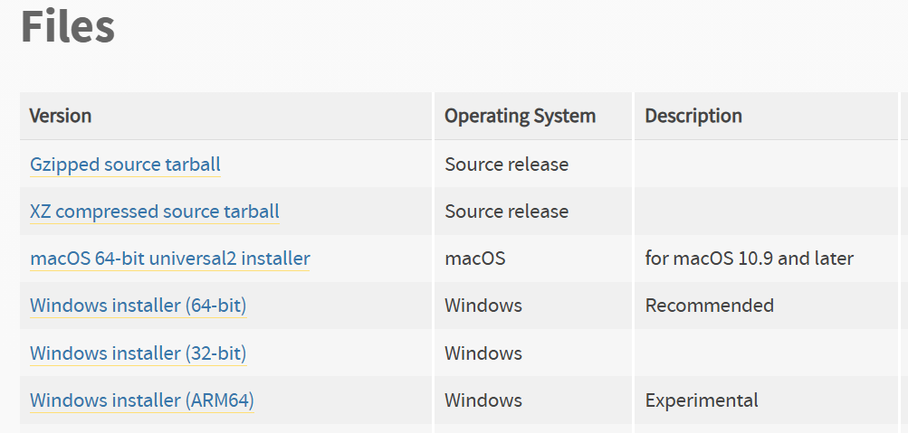

#### Windowsの場合

- インストーラーをダブルクリック→下部チェックボックスを確認して「Install Now」
  - **注意：CSEノートパソコン（Windows）は「Use admin privileges when installing py.exe」を外す**
  - 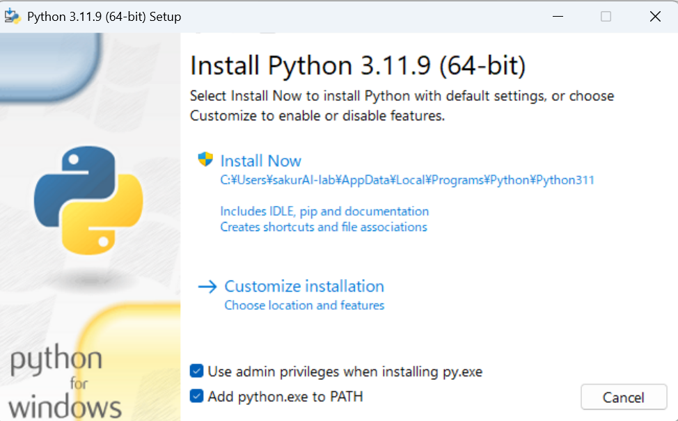


- 「Disable path lenght limit」を押して終了
  - **注意：CSEノートパソコン（Windows）は実行できないため，「Close」を押して終了**
  - 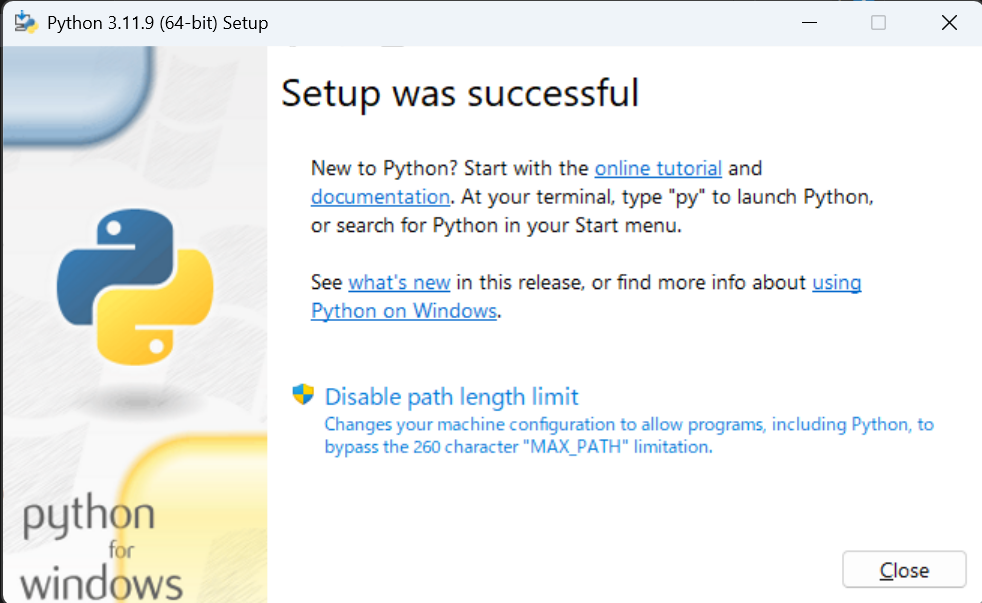

#### macの場合

- インストーラー（例：python-3.11.9-macos11.pkg）を立ち上げる
- 「続ける」→「同意する」→「インストール」で完了
  - 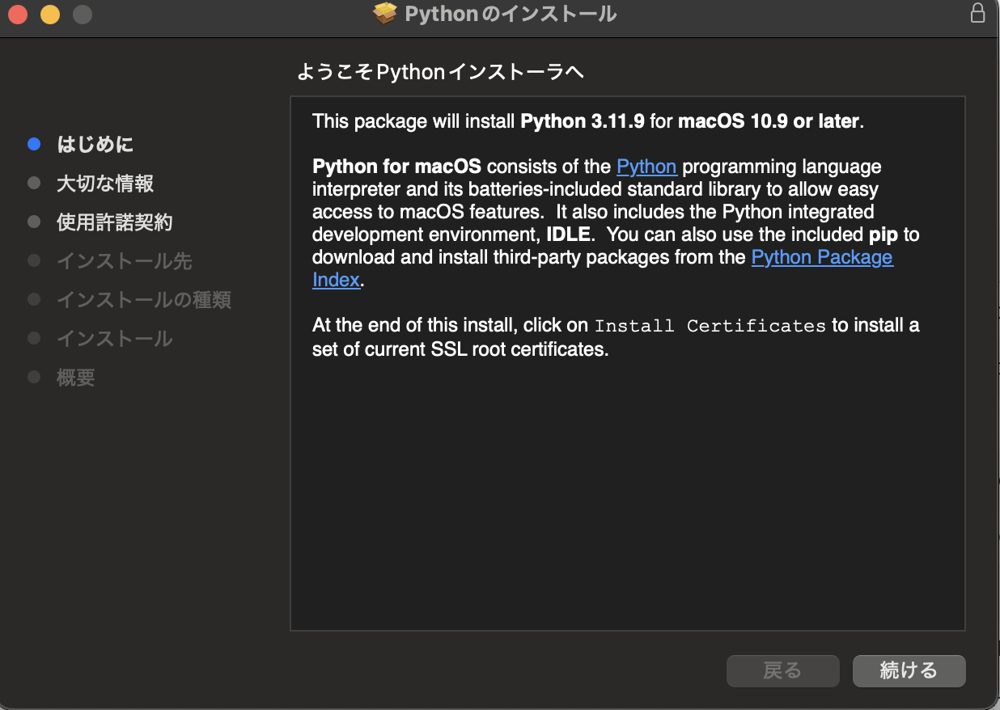
- 下記メッセージには「同意する」
  - 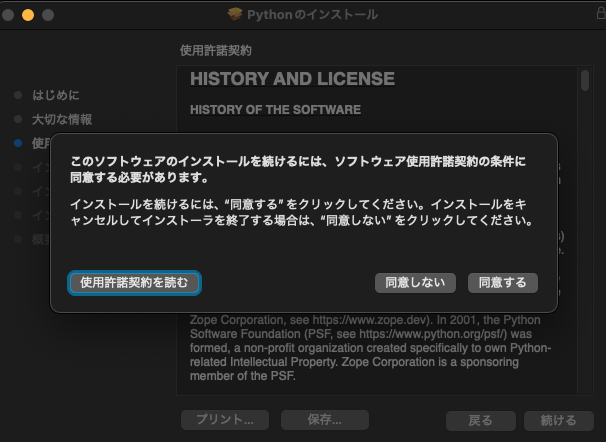

### インストール後の確認

VSCodeのterminalで，
もし，`python -V`で`Python 3.11.9`と出てこない場合

- まず，terminalを一旦閉じて，開き直してください（VSCodeの再起動でも可）

その後，`python -V`で

- 別のバージョンが表示されているとき，

  - 以前，別のバージョンをインストールしていた可能性があります

  - （ubuntuの場合）
    - `python3.11 -V`を試してください

  - (Windowsの場合)
    - `py -3.11 -V`を試してください
    - もし，バージョンが表示された場合，コマンドの「python」を「py -3.11」に逐一読み替えてください
      - ex) `python -m venv venv`→`py -3.11 -m venv vnev`
      - ex) `python connect_toio.py`→`py -3.11 connect_toio.py`
    - 表示されない場合，一度インストーラーを開き，「Modify」→「Next」→「Add Python to environement variables」にチェックして「Install」
      - 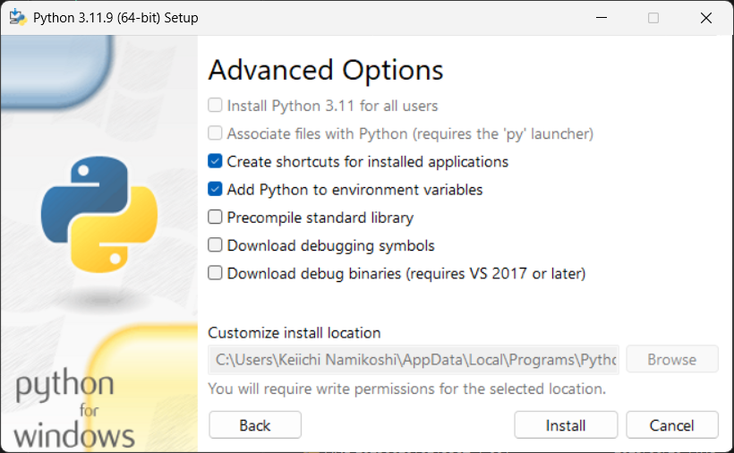

- `Python`のみが表示される（Windows）

  - パス設定に失敗している可能性があります．
  - 一度インストーラーを開き，「Modify」→「Next」→「Add Python to environement variables」にチェックして「Install」
      - 

---
## VSCode

### インストール済みか確認

#### Windowsの場合

- 下部の検索窓で「visual studio code」を検索
- 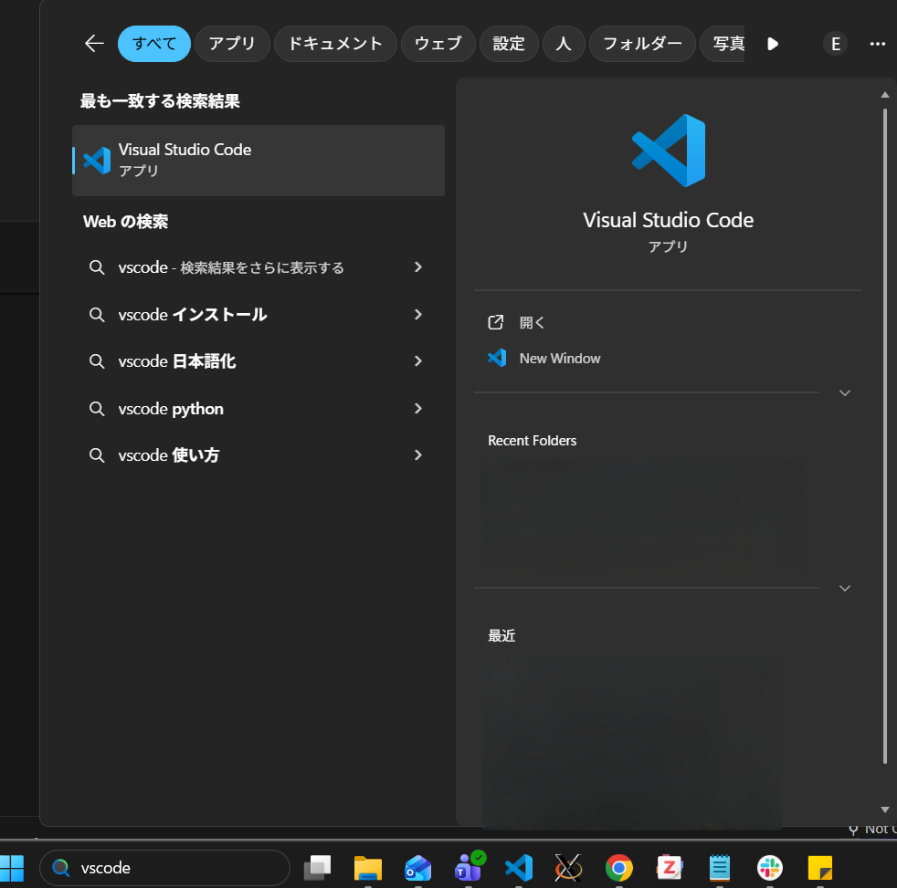

#### macの場合

- Launchpadで「visual studio code」を検索/「アプリケーション」フォルダを探す

#### CSE（Ubuntu）の場合

- 左上の「メニュー」から「visual studio code」を検索
- 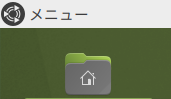

### インストール手順

- インストーラーのありか
  - 「download VScode」でインターネット検索
  - https://code.visualstudio.com/download

#### Windowsの場合

- インストーラーをダブルクリック
  - 案内に従って「次へ」
  - 下記画像は「追加タスクの選択」の推奨設定
  - 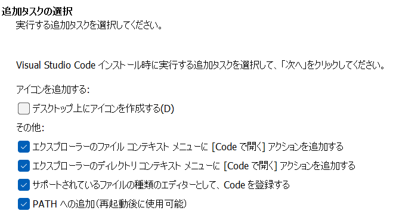

#### macの場合

- 下記メッセージが出た場合は「開く」
  - 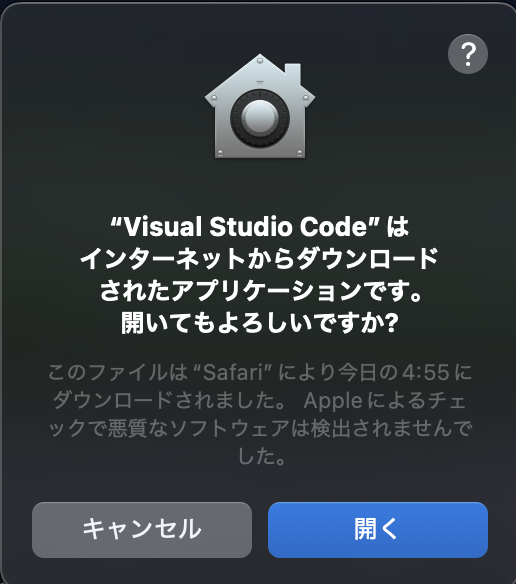
- ダウンロードされた「Visual Studio Code」を「アプリケーション」フォルダへ移動してから起動

### VSCodeインストール後

- 起動後，左側の「拡張機能」で下記を追加
  - Python (publisher: Microsoft)
  - 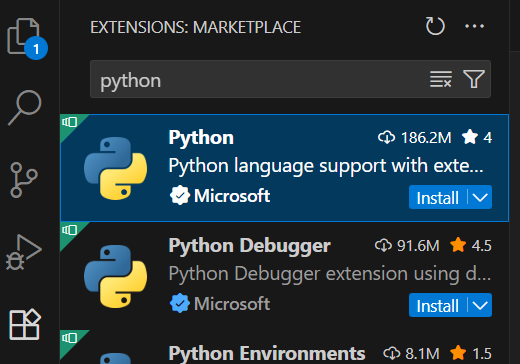


---
## 演習コード

### ダウンロード→VSCodeで開く

- GitHubのページへアクセスしてダウンロード
  - Code（緑ボタン）→「Download ZIP」
  - 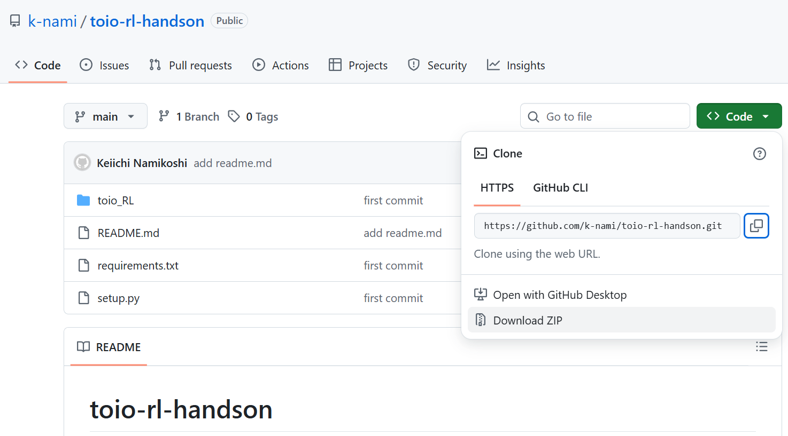

- ダウンロードされたzipファイルを展開（解凍）して，使いやすいディレクトリへ移動
  - （Windowsの場合）zipファイルを右クリックして「すべて展開．．．」
  - 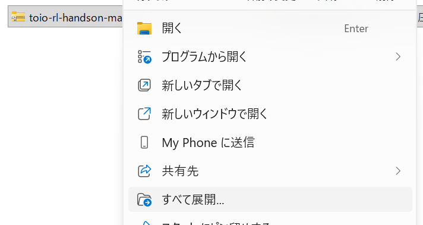

- VSCodeで開く
  - VSCodeを立ち上げる→左上「File」の「Open Folder...」で，展開したフォルダを選択
  <!-- - （方法1）VSCodeを立ち上げる→左上「File」の「Open Folder...」で，展開したフォルダを選択
  - （方法2，Windowsの場合）
    - `README.md`のあるフォルダに入ってから余白で右クリック「その他オプションを確認」
    - 
    - 「Codeで開く」
    - 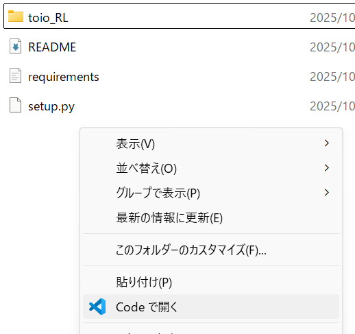 -->

- VSCodeで開いた状態
  - 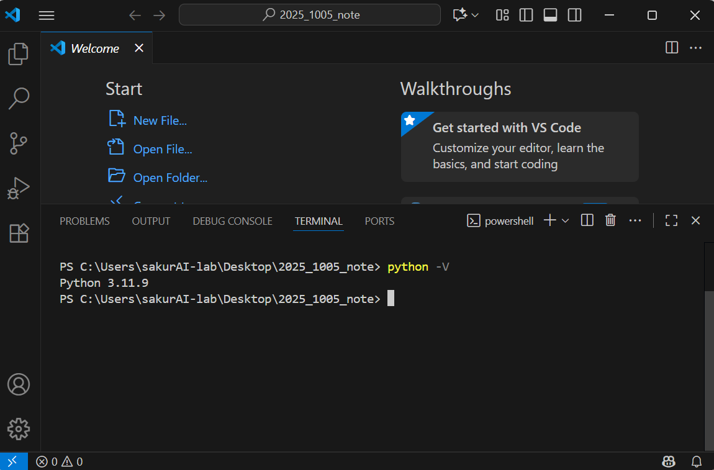

- terminalが開かれていない場合は，「Terminal」→「New Terminal」
  - 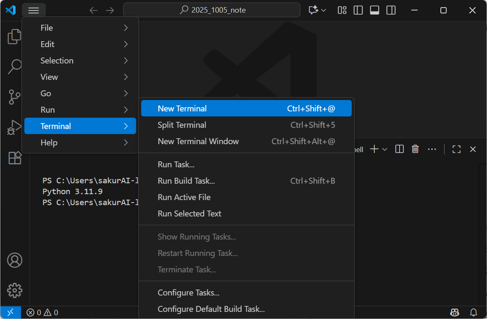

- Windowsの場合，Terminalにはコマンドプロンプトを推奨
  - 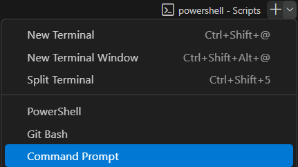


---
## Python仮想環境

使用している計算機，Pythonのインストール状況によって，いくつかの場合に分かれます．

- A. CSE（Ubuntu）の場合
  →[Anacondaを使う](#anacondaを使う場合)
- B. Windowsかつ，コマンド`Python -V`で
  - B-1. `Python 3.11.9`と表示される場合
    →[venvを使う](#venvを使う場合)
  - B-2. 表示されず，コマンド`py -3.11 -V`で`Python 3.11.9`と表示される場合
    →[pythonをpy -3.11に読み替えながらvenvを使う](#venvを使う場合)
  - B-3. `Python`と表示される場合
    →パスが通っていません．一度，再インストールしてください
- C. その他（mac, linux）かつ，コマンド`Python -V`で
  - C-1. `Python 3.11.9`と表示される場合
    →[venvを使う](#venvを使う場合)
  - C-2. 表示されず，コマンド`Python3.11 -V`で`Python 3.11.9`と表示される場合
    →[pythonをpython3.11に読み替えながらvenvを使う](#venvを使う場合)
  - C-3. その他
    →Pythonがインストール済みかつパスが通っているか確認してください

### Anacondaを使う場合

```bash
# インストール済みか確認
conda -V
conda 4.14.0

# 環境を作成（通信環境によっては，5分以上かかります）
conda env create -f environment.yml

# doneと表示されたのち、下記コマンドで「toio_rl」があればOK
conda env list
# conda environments:
#
toio_rl               *  /home/staff/<User>/.conda/envs/toio_rl
base                     /usr/local/anaconda3
python311                /usr/local/anaconda3/envs/python311

# 環境に入るとき
conda activate toio_rl

# 環境から出るとき
conda deactivate
```

### venvを使う場合

- `py -3.11`や`python3.11`を使う場合は，`python`を置き換えてください

```bash
# venvが存在するか確認
python -m venv -h
usage: venv [-h] [--system-site-packages] [--symlinks | --copies] [--clear] [--upgrade] [--without-pip]
            [--prompt PROMPT] [--upgrade-deps]
            ENV_DIR [ENV_DIR ...]

# 仮想環境に入る
# mac/ubuntuの場合
source venv/bin/activate
# windows（コマンドプロンプト）の場合
venv\Scripts\activate
# windows（powershell）の場合
venv\Scripts\activate.ps1
# ただしwindows(powershell)の初回は下記
PowerShell Set-ExecutionPolicy RemoteSigned

# パッケージをインストール
pip install -r requirements.txt

# 環境から出るとき
deactivate
```

---
## 補足


## VSCode実行時（mac）
- コード実行時に下記の表示が出る場合は「許可」

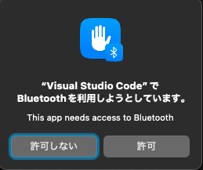

- 許可していない場合，コード実行時に下記のようなエラーが出ることがあります

```bash
(venv) <User>@<Host> <Directory> % python connect_toio.py 
Traceback (most recent call last):
...（中略）...
bleak.exc.BleakError: Bluetooth device is turned off
```


## 動作が重くなる（mac）
- `toio_RL/p2_online_rl/train.py`を実行すると，下記メッセージで一瞬止まるが，実行は可能

```bash
Matplotlib is building the font cache; this may take a moment.
```

## CSE（Ubuntu）でvenvが使えない

- `venv -h`が動くように見えても、実行できません

```bash
<User>@<Host>:~ > python -m venv venv
The virtual environment was not created successfully because ensurepip is not
available.  On Debian/Ubuntu systems, you need to install the python3-venv
package using the following command.

    apt install python3.10-venv

You may need to use sudo with that command.  After installing the python3-venv
package, recreate your virtual environment.
```

## CSE(Windows)でPythonがインストールできない/起動しなくなった

- まずは，インストーラーでmodifyや再インストールを試してください

- 最悪時の対処法：組み込み版を使用
  - https://note.com/maru_5251/n/n6664cef94f8d
  - 注意：通常のインストールより手間がかかります

## toioに繋がらない

いくつかの可能性が考えられます

- toioの電源が入っていない
- PCのBluetoothがoffになっている
- toioのIDを打ち間違えている
- コードが間違っている

